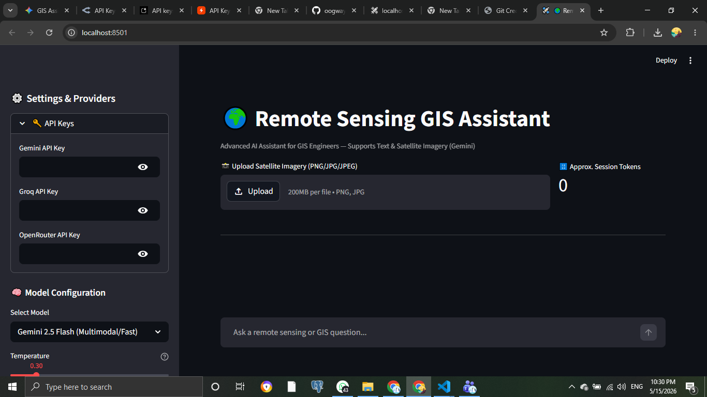

# 🌍 AI-Powered Remote Sensing GIS Assistant

An AI-powered assistant tailored for GIS engineers and Remote Sensing Analysts. This tool utilizes multimodal Large Language Models (LLMs) to perform visual assessments of satellite imagery, classify land cover, and provide structured geospatial insights, while strictly maintaining the boundary between AI suggestions and required manual GIS workflows.

## ✨ Features
- **Multimodal Image Analysis:** Upload satellite imagery (PNG/JPG) for instant visual assessment and land cover estimations using Gemini's vision capabilities.
- **Multi-Provider Support:** Switch seamlessly between Gemini (Multimodal), Groq (High-speed text), and OpenRouter APIs.
- **Customizable System Prompt:** Tailor the AI's persona and constraints (e.g., forcing EPSG code citations and acknowledging analysis limitations).
- **Structured JSON Output:** Toggle strict JSON responses for easy integration with automated GIS pipelines and spatial databases.
- **Chat History & Export:** Maintain session state and export entire analysis conversations to Markdown.
- **Real-Time Token Counter:** Track usage and context window limits during long analysis sessions.

## 🛠️ Setup Instructions

### 1. Clone the Repository
```bash
git clone [https://github.com/oogway5/GIS_Assistant.git](https://github.com/oogway5/GIS_Assistant.git)
cd GIS_Assistant

### 2. Create a Virtual Environment
It is highly recommended to use an isolated environment.
```bash
# On Windows:
python -m venv venv
venv\Scripts\activate

# On macOS/Linux:
python3 -m venv venv
source venv/bin/activate
```

### 3. Install Dependencies
Install all required libraries using the provided requirements file:
```bash
pip install -r requirements.txt
```

### 4. Environment Variables
Copy the template `.env.example` file to create your own hidden `.env` file:
```bash
# On Windows (Command Prompt):
copy .env.example .env

# On macOS/Linux/GitBash:
cp .env.example .env
```
Open the `.env` file and securely add your API keys:
```env
GOOGLE_API_KEY=your_gemini_api_key_here
GROQ_API_KEY=your_groq_api_key_here
OPENROUTER_API_KEY=your_openrouter_api_key_here
```

## 🚀 Running the Application
Once the setup is complete, start the Streamlit server:
```bash
streamlit run app.py
```
The application will open automatically in your default web browser at `http://localhost:8501`.

---

## 📸 Screenshots

* **Main Chat Interface:**
  
